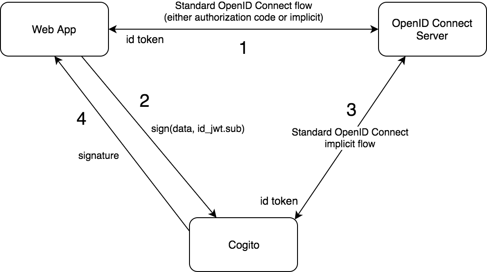
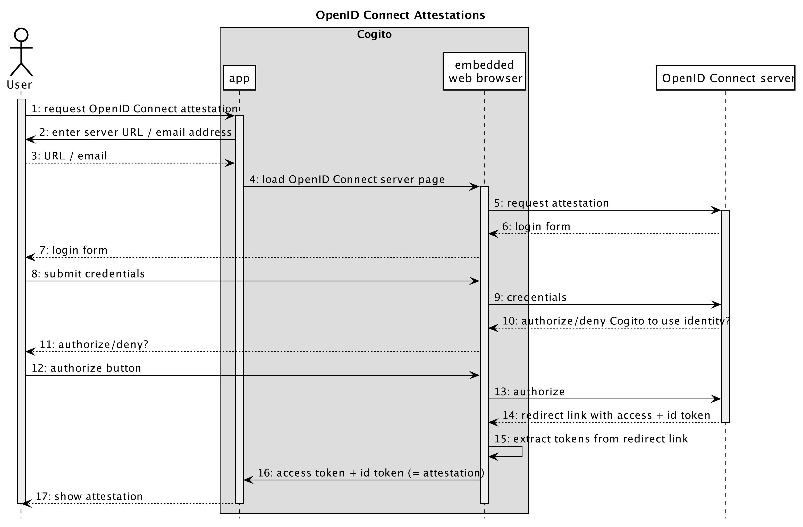

Cogito is an Identity management app.

### Metaphor
You are a _diamond_ with many _facets_. The diamond is you
as a person, all aspects of you. In a specific context, you show a
specific facet of your diamond to the world, not all of you.

Identity Management
-------------------

### Cogito Identity Management Solution

In this document we present Cogito Identity Management Solution.

Our objective is to create possible broad and flexible identity management solution that can satisfy possible wide range of use-cases: private anonymous login (inCOGnITO), zero-knowledge verifiable-claims, public identity (DIDs), and facilitating login to existing OpenID providers. Finally, we also consider the use of Cogito for end-to-end encrypted storage.

#### Private anonymous login (inCOGnITO)

This solution is inspired by the [Secure Quick Reliable Login](https://www.grc.com/sqrl/sqrl.htm). We all need to study that well to understand crypto and algorithms involved.

##### Introduction zk-SNARKS

The goal of zero-knowledge proofs is for a *verifier* to be able to convince herself that a *prover* possesses knowledge of a secret parameter, called a *witness*, satisfying some relation, without revealing the witness to the verifier or anyone else.
We can think of this more concretely as having a program, denoted `C`, taking two inputs: `C(x, w)`. The input `x` is the public input, and `w` is the secret witness input. The output of the program is `boolean`, i.e. either `true` or `false`. The goal then is given a specific public input `x`, prove that the prover knows a secret input `w` such that `C(x,w) == true`.

A zk-SNARK consists of three algorithms `G`, `P`, `V`. A zk-SNARKS generator `G` takes two inputs: program *C* and a parameter *lambda*. The output of the generator are two keys: a *proving* key and a *verification* key, denoted `(pk, vk)` respectively. After generation the keys can be made public. The prover `P` takes as input the proving key `pk`, a public input `x` and a private witness `w`. The algorithm generates a proof `prf = P(pk, x, w)` that the prover knows a witness `w` and that the witness satisfies the program.
The verifier `V` computes `V(vk, x, prf)` which returns `true` if the proof is correct, and false otherwise. Thus this function returns true if the prover knows a witness w satisfying `C(x,w) == true`. Lambda has to be destroyed immediately after `vk` and `pk` has been generated. The reason for this is that anyone who knows this parameter can generate fake proofs. Specifically, given any program `C` and public input `x` a person who knows `lambda` can generate a proof `fake_prf` such that `V(vk, x, fake_prf)` evaluates to true without knowledge of the secret `w`.

It is therefore clear that the secret holder, the one who generates the proof `prf`, cannot be responsible for generating the `(pk, vk)` keys. Verifiers would have to have a high level of confidence in the prover to destroy `lambda`. For this reason, the generation should be performed the verifier who then distributes the keys to the provers.

For a more details about zk-SNARKS we recommend [Introduction to zk-SNARKs with examples](https://media.consensys.net/introduction-to-zksnarks-with-examples-3283b554fc3b), which fragments has been used above. For an example and spectacular approach of using multi-party-computation to bootstrap zk-SNARK we refer the reader to [The Design of the Ceremony](https://z.cash/blog/the-design-of-the-ceremony.html) and [Zcash Parameters And How They Will Be Generated](https://z.cash/blog/generating-zcash-parameters.html) from [Zcash](https://z.cash).

##### Applying zk-SNARKS to verifiable claims

We describe the application of zk-SANRKs to verifiable claims using a running example where a student of a university can receive a discount when buying goods in a store that honors students of that university with this privilege.

Bob is a student of a university (`ut`). Bob visits the university and requests a credential proving that he is a student of that university. After showing his id document, university issues the following credential to Bob:

```
ut.student <- bob
```

Here `bob` denotes a public key of a person that holds the corresponding private key (Bob in our case). Requesting the credential make this public key disclosed. If Bob, however, is consistent and uses different public key to identify himself by each service, his privacy will not suffer serious damage. Of course, we cannot forget that university can leak information as well.

A credential can be in a text form or it can be encoded in one of the available credential formats (usually XML). The credential is then signed by the university to protect its integrity. This is so that Bob can still prove his credential is correct to the university. As we will see, thanks to zk-SNARKs, Bob will never have to reveal his credential to anyone else and still be able to prove he is a student of the university. Let's see how.

Apart from singing the credential, the university also encrypts it with the public key of Bob (designed with `bob`) and delivers it to Bob (it is encrypted and only Bob can decrypt it, so it does not matter how the credential is delivered to Bob). The university also creates a *zero-knowledge credentials*, which is a signed tuple of the hash of the original credential `c`, and the role name *student*: `(H(c), 'student')`
To summarize If `c` is a signed credential then `zk(c)` will denote the signed zero-knowledge credential. `H(c)` will be the public input `x` to the zk-SNARKs algorithm and `c` will be the corresponding secret witness. Program `C`, the input to the generator `G`, will be:

```
x = H(c)
w = c
C = (x,w) => {
  return x === hash(w)
}
```

The store will run the generator `G` and will store the prover key `pk` and the verification key `vk`. These keys do not have to be protected. When Bob wants to prove that he is a student of the university, the store sends him the prover key `pk`. Using this key, the zero-knowledge credential, and the credential itself (after being decrypted - only Bob can decrypt the credential, so nobody else can create this proof), Bob creates a proof that he is a student of the university:

```
prf = P(pk, H(c), c)
```

To be precise, the university could also create such a proof as the issuer of the credential.

> The university can also leak information about all her students...

In any case, university does not know the public key that Bob uses to identify himself at the store, and even more importantly university does not have access to the corresponding private key that Bob keeps in his secure element on his phone. Bob signs every message he exchanges with the store, and so he also signs the generated proof `prf`. The store receiving this proof can be assured that it was computed by the actual subject of the credential.

We could also use more complex verification function `C`:

```
x = enc(bob, H(c))
w = {c, priv(bob)}
C = (x, {c, k}) => {
  return (dec(k, x)) === hash(c))
}
```

Here, the pubic input is the encrypted hashed credential and the secret witness has two components: the credential itself (again after being decrypted) and the private key corresponding to the public key used in the credential.

The disadvantage of this solution would be that the verification function becomes far more cryptographically-heavy and that it requires the private key as the input. This would effectively forbid the prover from keeping the private key in the secrete element of the device.

Bob will store `zk(c)`. When Bob wants to prove to the store that he is a student of the university he provides the zero-knowledge credential to the store. In order to verify that Bob is indeed a student of the university, the store performs the following steps:

1. Verify the signature on the `zk(c)` using the public key of the university.
2. Check that the role (`student` in our case) specified in `zk(c)` matches the required discount role.
3. Assert that `V(vk, H(c), prf) === true`.

The store does not know the actual Bob's identity. The store only knows one of Bob's identities - the one that Bob uses to authenticate himself with the store. Recall that Bob uses different identity for each and every service, including the university.

#### Cogito and Decentralized Identifiers (DIDs)

The [Secure Quick Reliable Login](https://www.grc.com/sqrl/sqrl.htm) solution focuses on the secure login process. [Decentralized Identifiers (DIDs)](https://w3c-ccg.github.io/did-spec/) aims at further strengthening the user's control of her identity. DIDs still allow for multiple identities, each one being persistent and immutable, bound to an underlaying distributed ledger (even multiple underlying distributed ledger ledger over time).

The [DID Auth](https://github.com/WebOfTrustInfo/rebooting-the-web-of-trust-spring2017/blob/master/topics-and-advance-readings/did-auth.md) specification from the [The DID Family of Specifications](https://github.com/WebOfTrustInfo/rebooting-the-web-of-trust-spring2017/blob/master/topics-and-advance-readings/did-family-of-specifications.md) explains the subtle difference between authenticating as the owner of an *identifier* versus the owner of a *specific key*:

> The extra level of indirection allows the individual to manage key rotation, delegation of authority, synchronization across devices and more in a manner which is fully under their control and transparent to the relying party. An open specification for authentication using an identifier on a distributed ledger could be highly secure and interoperable while still being easy for users and protecting their privacy.

For this reason we need to consider the benefits of being compliant with DIDs and how to apply it the Cogito Identity Management system.

Please join the discussion on how to integrate DIDs with Cogito by adding content and comments in [DIDs for Cogito self-sovereign identity solution](https://confluence.atlas.philips.com/display/BLA/DIDs+for+Cogito+self-sovereign+identity+solution) document.

#### Cogito for OpenID providers

TBD...


#### End-to-end encrypted storage

It is very educative to study the documentation of [keybase.io](https://keybase.io/). Even though keybase is not explicit about it, its crypto shares a lot with [Secure Quick Reliable Login](https://www.grc.com/sqrl/sqrl.htm). In particular, the following documents from [Keybase Crypto Documents](https://keybase.io/docs/crypto/overview) will be a valuable input:

1. [Crypto spec: the Keybase filesystem (KBFS)](https://keybase.io/docs/crypto/kbfs)
2. [Local Key Security](https://keybase.io/docs/crypto/local-key-security)


Architecture
------------

_Cogito_ is a self-sovereign identity management app. It manages your digital
identity, consisting of cryptographic key pairs for signing/verifying and
encrypting/decrypting data, as well as attestations: claims about your
identity. This document describes the architecture of systems that use
_Cogito_. Specifically, it explains how identity information from OpenID
Connect systems can be integrated in a _Cogito_ identity. This way users can
sign using a self-sovereign identity, which is provably backed by an
identity from a third-party OpenID Connect server. Typical use cases are
systems where users need to sign blockchain transactions using a corporate
identity from an OpenID Connect server.

### Use Case: Signing Data with OpenID Connect-backed Identity

Cogito can sign data on behalf of a (web) app, while giving the
guarantee that the signing identity is authenticated by an OpenID
Connect server. The diagram "Signing data with Cogito" provides a
high-level overview of the interactions that are relevant for this
use case.



1. As usual in such settings, the web app authenticates the user
   with the OpenID Connect Server, either using the [OpenID Connect
   Authorization Code Flow][OpenIDAuthCode], or using the [Implicit
   Flow][OIDCImplicit]. When successful, the web app obtains an
   access token and an identity token. The identity token is a
   [JWT][JWT] that contains a `sub` field: the identifier of the
   authenticated user in the OpenID Connect server.
2. The user wants to sign data using their Cogito identity. So
   the web app refers the user to Cogito, using a QR code to setup
   a secure communication channel between the web app and Cogito.
   The secure channel is built using [Telepath][Telepath]. Cogito
   requires both the data to be signed and the `sub` field
   from the user's identity token.
3. Cogito now starts a standard [OpenID Connect Implicit
   Flow][OIDCImplicit] to establish that the user is authenticated
   with the OpenID Connect server. When successful, Cogito receives
   an identity token from the OpenID Connect server. Cogito ensures
   that the identity has the same `sub` value as the one received
   in the signing request.
4. Now that the user is authenticated with Cogito and the `sub`
   is verified, Cogito signs the data using the keys it has for the
   identity, and returns the signature to the web app through
   Telepath.

The third step above, the authentication between Cogito and the
OpenID Connect server, is done only once. We refer to this as an
_attestation_: the OpenID Connect server gives the user's identity
an attestation that it is a valid user in the OpenID Connect server.
The section "Attestation from OpenID Connect Server" provides
more detail about this step.

#### Usability

A disadvantage from usability point of view, is that the user has to
log in to the OpenID Connect Server twice: once from the web app, and
once from the Cogito app. Inside the Cogito app, this is needed only
once (and when the token expires). Since this needs to be done the
first time though, the initial user experience is suboptimal.

#### Attestation from OpenID Connect Server

One type of attestation that users can have for their identity, is an
attestation from an OpenID Connect Server. The most obvious use case for this
is that a user gets an attestation from their company. In other words: the
company signs a claim that indeed the user is an employee of the company.

This attestation can be added to the user's identity using the standard
[OpenID Connect _implicit flow_][OIDCImplicit]. The diagram "OpenID Connect Attestations"
illustrates this.



These are the steps displayed in the sequence diagram:

1. Inside the Cogito app, the user indicates that she wants to receive
   an attestation from an OpenID Connect server.
2. Cogito asks the user to identify which OpenID Connect server is to be used.
3. The user provides server URL or email address; in the case of an email
   address, it is converted to an OIDC Connect server URL by the app.
4. Cogito tells the embedded web browser to load the OpenID Connect server
   URL.
5. Here the standard OpenID Connect _implicit flow_ starts. The browser sends
   the OpenID Connect authentication request.
6. The OpenID Connect server responds with an HTML login form.
7. The form is displayed to the user.
8. The user submits the form with their credentials.
9. The credentials are sent to the OpenID Connect server.
10. The OpenID Connect server verifies the credentials, and if OK responds with
    an HTML page asking the user to allow Cogito to user their OpenID Connect
    identity.
11. The page is displayed to the user.
12. The user reviews the information and clicks the 'authorize' button.
13. The browser forwards to the OpenID Connect server.
14. The OpenID Connect server redirects the browser to the URL specified in
    step (5), passing the access token and id token in the URL fragment.
15. The browser extracts the tokens from the URL fragment...
16. ... and sends them to the app.


[OIDCImplicit]: https://openid.net/specs/openid-connect-core-1_0.html#ImplicitFlowAuth
[OpenIDAuthCode]: https://openid.net/specs/openid-connect-core-1_0.html#CodeFlowAuth
[JWT]: https://jwt.io
[Telepath]: /telepath

iOS App
-------

The architecture of the Cogito iOS App follows the [FLux](http://facebook.github.io/flux/) architecture (although in a simpler way). It is a combination [ReSwift](https://github.com/ReSwift/ReSwift) and [RxSwift](https://github.com/ReactiveX/RxSwift), using [ReRxSwift](https://github.com/svdo/ReRxSwift) to make the combination easier to use.

### Key Management

Key Management is decoupled from any specific Ethereum Blockchain network.

It is based on the [Mobile: Account management](https://github.com/ethereum/go-ethereum/wiki/Mobile:-Account-management) from Ethereum. An interesting read may also be [Mobile: Introduction](https://github.com/ethereum/go-ethereum/wiki/Mobile:-Introduction)


### Signing transactions

[JSON RPC](https://github.com/ethereum/wiki/wiki/JSON-RPC#eth_sendtransaction)

In particular [eth_sendtransaction](https://github.com/ethereum/wiki/wiki/JSON-RPC#eth_sendtransaction)

Ethereum
--------

### Cogito Web3

An Ethereum [Web3][web3] provider that uses the Cogito app to manage accounts and
signing. Requires a [Telepath channel][telepath] to be set up for communication with the
Cogito app.

#### Usage

```javascript
const Web3 = require('web3')
const CogitoProvider = require('@cogito/cogito-web3')

const provider = new CogitoProvider({
  originalProvider: new Web3.providers.HttpProvider("http://localhost:8545")
  telepathChannel: /* a previously set up telepath channel */
})
const web3 = new Web3(provider)
```

#### Sources

https://gitlab.ta.philips.com/blockchain-lab/cogito/tree/master/packages/cogito-web3

[web3]: https://github.com/ethereum/web3.js

OpenID
------

In this section I include some handy links and not so obvious information about OpenID.

### Brief introduction to OpenId

You may want to take a look at [OpenID Connect explained].

In the following section we put the most important insights

### Authentication flows

There are three authentication flows: *authorization code flow*, *implicit flow*, and *hybrid flow*. The hybrid flow is rarely used and so here we focus on the first two.

The *authorization code flow* is used in traditional backend-based apps and in native apps (like those for iOS and Android). In this flow the, when the user initiates the login action (e.g. by clicking *login* button the page) the browser redirects to a so-called *authorization endpoint* where the user can input her login credentials. Besides other parameters, the request will include the `response_type` set to `code` to indicate the authorization flow and `redirect_uri` callback URI. After successful authentication the OpenID provider (OP) will call the client `redirect_uri` with an authorization code. Effectively the redirect request with the authorization code will end up on the server. The server will use the *token endpoint* of the OP and the received authorization code to retrieve the ID token. Notice that in the authorization code flow the ID token is not directly exposed to the browser.

In the *implicit flow*, all tokens are returned from the Authorization Endpoint; the Token Endpoint is not used. On successful authentication the OP responds directly with the ID token - thus, the ID token is exposed to the browser, thus can be perceived as less secure.

The details about the implicit flow can be found [here](https://openid.net/specs/openid-connect-core-1_0.html#ImplicitFlowAuth). The authentication request follows the rules for the authentication code flow as described in [Section 3.1.2.1](https://openid.net/specs/openid-connect-core-1_0.html#AuthRequest) of the [OpenID Connect Core Specification].

Our Cogito App also uses the implicit flow to authenticate with our open id provider. Below are the request parameters from used by Cogito App:

- `response_type`: id_token
- `client_id`: cogito
- `redirect_uri`: https://cogito.mobi/applinks/openid-callback
- `nonce`: e37976ef5c561f67574b365a8a5fe6e35f0c201ba5749dfd96158e27808a17d3

And below is the complete url with all params:

```
"https://iam-blockchain-dev.cogito.mobi/auth/realms/master/protocol/openid-connect/auth?response_type=id_token&client_id=cogito&redirect_uri=https://cogito.mobi/applinks/openid-callback&scope=openid&nonce=e37976ef5c561f67574b365a8a5fe6e35f0c201ba5749dfd96158e27808a17d3"
```


And here is an example of a successful response from the OpenID provider:

```
https://cogito.mobi/applinks/openid-callback#id_token=eyJhbGciOiJSUzI1NiIsInR5cCIgOiAiSldUIiwia2lkIiA6ICJRXy05VHhHLWxQUkpIMlVJZ3FHQkZDekVBenZvOVQ0amZTLWExZUx0M1k0In0.eyJqdGkiOiIwYzU1OTFlYi00MzZjLTQ4NjctYTEzOC1hMDEzM2MxN2U4NDgiLCJleHAiOjE1MTgxMzI5OTgsIm5iZiI6MCwiaWF0IjoxNTE4MTMyMDk4LCJpc3MiOiJodHRwczovL2lhbS1ibG9ja2NoYWluLWRldi5jb2dpdG8ubW9iaS9hdXRoL3JlYWxtcy9tYXN0ZXIiLCJhdWQiOiJjb2dpdG8iLCJzdWIiOiJkMGVmNTEwNy0wZjI1LTQ5OTUtODIwMS02MTliNWFjY2Y5MmQiLCJ0eXAiOiJJRCIsImF6cCI6ImNvZ2l0byIsIm5vbmNlIjoiZTVlNjhhMDk2OGI3MGI4MjE5MDQzZjE1YmEyNGM2ZTEwYjk2Mzc2MjEyMTdlMTNmOTNjNzg2YjQ4YmZlZDViZSIsImF1dGhfdGltZSI6MTUxODEzMjA5OCwic2Vzc2lvbl9zdGF0ZSI6IjczODM4ZTE0LTVlYzgtNDUwNy04OWZmLTZhMTAxNjM2NmY0OSIsImFjciI6IjEiLCJuYW1lIjoiRGVtbyBVc2VyIiwicHJlZmVycmVkX3VzZXJuYW1lIjoiZGVtbyIsImdpdmVuX25hbWUiOiJEZW1vIiwiZmFtaWx5X25hbWUiOiJVc2VyIiwiZW1haWwiOiJkZW1vQGV4YW1wbGUuY29tIn0.GD0FpRvrVEwRRqJ5CrCkiDl6ss7J-QqznKwQF1LpugBqTK88DG_yBKzZhUIYN3ie9rfY75KL3h_CjJ9seXNe3YMWmxYfTiEG6ShqolS_JkCwpExFS64wj0IgergxMLWpkoExen8hHSmQL2UW7VeuK1eX31Tm2nLkp_8Bf
```

### OpenID provider configuration discovery

OpenID Connect defines a mechanism for an OpenID Connect Relying Party to discover the End-User's OpenID Provider and obtain information needed to interact with it, including its OAuth 2.0 endpoint locations.

The [OpenID Provider Configuration Request] describes the details. For our identity provider the URI is:

```
https://iam-blockchain-dev.cogito.mobi/auth/realms/master/.well-known/openid-configuration
```

It returns:

```
{
  "issuer":"https://iam-blockchain-dev.cogito.mobi/auth/realms/master",
  "authorization_endpoint":"https://iam-blockchain-dev.cogito.mobi/auth/realms/master/protocol/openid-connect/auth",
  "token_endpoint":"https://iam-blockchain-dev.cogito.mobi/auth/realms/master/protocol/openid-connect/token",
  "token_introspection_endpoint":"https://iam-blockchain-dev.cogito.mobi/auth/realms/master/protocol/openid-connect/token/introspect",
  "userinfo_endpoint":"https://iam-blockchain-dev.cogito.mobi/auth/realms/master/protocol/openid-connect/userinfo",
  "end_session_endpoint":"https://iam-blockchain-dev.cogito.mobi/auth/realms/master/protocol/openid-connect/logout",
  "jwks_uri":"https://iam-blockchain-dev.cogito.mobi/auth/realms/master/protocol/openid-connect/certs",
  "check_session_iframe":"https://iam-blockchain-dev.cogito.mobi/auth/realms/master/protocol/openid-connect/login-status-iframe.html",
  "grant_types_supported":["authorization_code","implicit","refresh_token","password","client_credentials"],
  "response_types_supported":["code","none","id_token","token","id_token token","code id_token","code token","code id_token token"],
  "subject_types_supported":["public","pairwise"],
  "id_token_signing_alg_values_supported":["RS256"],
  "userinfo_signing_alg_values_supported":["RS256"],
  "request_object_signing_alg_values_supported":["none","RS256"],
  "response_modes_supported":["query","fragment","form_post"],
  "registration_endpoint":"https://iam-blockchain-dev.cogito.mobi/auth/realms/master/clients-registrations/openid-connect",
  "token_endpoint_auth_methods_supported":["private_key_jwt","client_secret_basic","client_secret_post"],
  "token_endpoint_auth_signing_alg_values_supported":["RS256"],
  "claims_supported":["sub","iss","auth_time","name","given_name","family_name","preferred_username","email"],
  "claim_types_supported":["normal"],
  "claims_parameter_supported":false,
  "scopes_supported":["openid","offline_access"],
  "request_parameter_supported":true,
  "request_uri_parameter_supported":true
}
```

[OpenID Connect explained]: https://connect2id.com/learn/openid-connect

[OpenID Connect Core Specification]: https://openid.net/specs/openid-connect-core-1_0.html#ImplicitFlowAuth

[OpenID Provider Configuration Request]: https://openid.net/specs/openid-connect-discovery-1_0.html#ProviderConfigurationRequest

### Keycloak - our OpenID Provider

#### Accounts

Our account user names and passwords can be found in our keybase blockchainlab team folder.

Cogito.mobi
-----------

### Amazon setup

Unless explicitly stated otherwise, all objects below are created in region `eu-central-1` (Frankfurt).

### S3

* Create S3 bucket called 'cogito.mobi'
    - public access
    - web site hosting enabled; specify `index.html`

### Certificate Manager

* Create certificate for `*.cogito.mobi` and `cogito.mobi` (i.e. together, one certificate). Make sure it is in region US East (N. Virginia) otherwise CloudFront will not be able to use it.
* Make sure validation succeeds before continuing (is this needed??)

### CloudFront

* Create CloudFront distribution with at least these properties:
    - Delivery method: web
    - Origin domain name: `cogito.mobi.s3-website.eu-central-1.amazonaws.com` (i.e. the URL including the region)
    - Viewer Protocol Policy: Redirect HTTP to HTTPS
    - Price Class: US, Canada, Europe
    - Alternate Domain Names: cogito.mobi
    - SSL Certificate: Custom SSL Certificate; select the one created above
    - Custom SSL Client Support: SNI

### Route 53

* Create record set:
    - Name: (empty) -> will use `cogito.mobi`
    - Type: A
    - Alias: Yes
        - select the CloudFront distribution as target

### Options Not Pursued

* S3 can be restricted so that it can only be served through CloudFront, not directly. See [AWS docs on Origin Access Identity][1] for more information.
* It should be possible to configure `www.cogito.mobi` -> `cogito.mobi` redirect. Something like this:
    - Create S3 bucket for `www.cogito.mobi` with same settings as above, except static web hosting: configure it to redirect.
    - Add `www.cogito.mobi` in CloudFront to the alternate domain names setting.
    - Add CNAME record in Route 53 for `www` with value `cogito.mobi`.


### Universal Link Setup

For the universal link to the app to work, a file `apple-app-site-association`
needs to be stored in the root of the S3 bucket. It must have content type
`application/json` and publicly accessible using the domain https://cogito.mobi.
Its contents should be:

    {"applinks":{"apps":[],"details":[{"appID":"MWTEZ4CYM6.com.philips.Cogito","paths":["*"]}]}}

You can use the [Branch.io validator][2] to check that the file is deployed correctly.


Push Notifications
------------------

Unlike some other solutions, Cogito only uses a QR code _once_, namely to setup a communication
channel between the web app and mobile Cogito app. After that, the web app can simply use the
channel to send requests to the app. This means that such requests are inevitably also sent when
the Cogito app is in the background on the mobile device, meaning that the user may not be aware
that an action needs to be performed inside the app.

For that reason, Cogito supports push notifications: whenever the user needs to perform an action
in the mobile app, Cogito can send the user a push notification to alert her and to allow her to
easily act on the push notification.

### Privacy
From mobile device point of view, push notifications work by the OS giving the app some kind of
device identifier. That identifier can then be used to send push notifications to. Even though
this identifier will be different for different apps on the device, there is only one such identifier
per app.

In a naive implementation, this identifier would be shared with the web app so that it can use it to
trigger push notifications. Cogito however is designed to support multiple identities, so that a single
user can use different identities for different web apps. Having a per-device unique token, used by
all web apps, would violate that: the even though the user chooses to use different identities, the
apps would all still receive one and the same (device) identifier.

### Solution
The solution to this problem depends on the push notifications provider that is used. We use [Amazon
Simple Notification Service][3] (SNS), which supports _topics_. Besides sending push notifications directly
to device identifiers, you can also send them to topics. So instead of using device identifiers directly,
we will create a unique SNS topic for every identity the user creates in the Cogito mobile app. This
topic is then shared with the web app instead of the device identifier.

This solution has another advantage. It is to be expected that at some point we will support the
user to run the Cogito mobile app on multiple devices (e.g. a tablet and a phone). In that scenario,
the device identifiers will be different by definition. In contrast, the SNS topic for every identity
can be the same across the users devices. This gives us a very easy way to send push notifictions
to all devices that a user owns, instead of just one specific device.

> *Open issue: Topic recycling*
>
> Using the approach outlined above requires one more attention point: topics will only be created,
> never deleted/recycled. When users delete identities inside the Cogito mobile app, there is no issue,
> because then the corresponding topic can also be deleted. But when the user deletes the app itself,
> this cannot be done.
>
> When the number of users becomes significant, this will be an issue that needs solving. A potential
> solution is to have the assignment of a topic to a user expire, but Amazon SNS does not support
> that natively. In other words, some sort of management application would probably have to be
> built around this. [See here for example.](https://stackoverflow.com/questions/38254516/aws-sns-workaround-for-100-000-topics-limit)


[1]: http://docs.aws.amazon.com/AmazonCloudFront/latest/DeveloperGuide/private-content-restricting-access-to-s3.html
[2]: https://branch.io/resources/aasa-validator/
[3]: http://aws.amazon.com/documentation/sns
