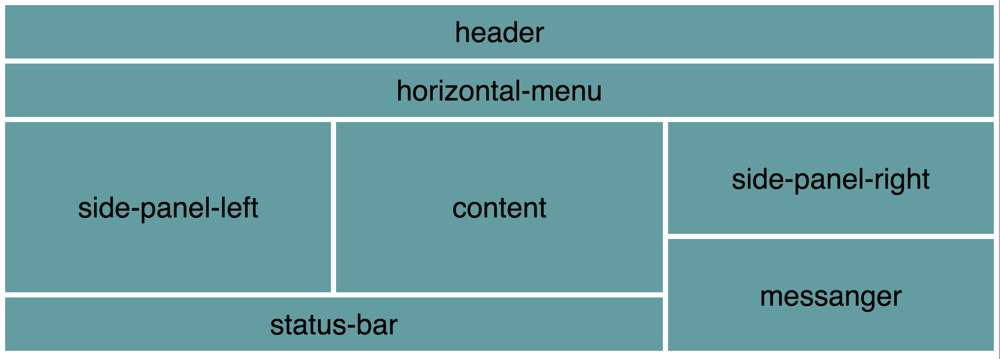

## css-grid-helper

This project describes a journey from ugly, old-fashined, css-based styling to fresh, modern and exciting way of building the styling with javascript - as demonstrated during live coding session at [NextBuild 2017](http://nextbuild.nl). You may disagree...that's ok with me.

> You can access the finished (and even slightly more elaborate) example CodePens at: [https://codepen.io/collection/XoYrVY/](https://codepen.io/collection/XoYrVY/).

### Instalation

After cloning run:

```shell
$ yarn install
```

To start the development server:

```shell
$ yarn start
```

Open the browser and go to [http://localhost:3000/](http://localhost:3000/).

### Discussion

This demo project encourages the experimentation with expressing css in javascript. CSS in Javascript allows for more declariative DSLs and can leverage the codding conventions.

An example here is very immature (I have put it all together in a couple of hours as demo) implementation of a `Grid` class, which should take away lots of boilerplate code, making creating the grid-based layout of a page much easier and cleaner. A demo is in React - my favorite environment.

So, how could it work?

Let's assume that you build a grid-based layout, and you want your grid to look like this:



It is maybe a bit overcomplicated, but not impossible in many cases, yet it already requires lots of markup. A ready to use markup may look like this:

```javascript
<div class="container">
  <section class="header">header</section>
  <section class="horizontal-menu">horizontal-menu</section>
  <section class="side-panel-left">side-panel-left</section>
  <section class="content">content</section>
  <section class="side-panel-right">side-panel-right</section>
  <section class="messenger">messenger</section>
  <section class="status-bar">status-bar</section>
</div>
```

and the associated styling may look like that:

```css
.container {
  display: grid;
  grid-gap: 5px;
  grid-template-areas:
    "header header header"
    "horizontal-menu horizontal-menu horizontal-menu"
    "side-panel-left content side-panel-right"
    "side-panel-left content side-panel-right"
    "side-panel-left content messenger"
    "status-bar status-bar messenger";
  grid-template-columns: 1fr 1fr 1fr;
  grid-template-rows: 1fr 1fr 1fr 1fr 1fr 1fr 1fr;
}

section {
  display: flex;
  justify-content: center;
  align-items: center;
  font-size: 20px;
  background-color: CadetBlue;
}

.header {
  grid-area: header;
}

.horizontal-menu {
  grid-area: horizontal-menu;
}

.side-panel-left {
  grid-area: side-panel-left;
}

.content {
  grid-area: content;
}

.side-panel-right {
  grid-area: side-panel-right;
}

.messenger {
  grid-area: messenger;
}

.status-bar {
  grid-area: status-bar;
}
```

I think it is already quite readbale comparing to what you would have if you try to achieve the same with e.g. flex, but I still feel it is also quite verbose and, in the end, error-prone.

The key to understanding the actual layout (without looking at the end result of course), is to look at the `grid-template-areas` CSS property:

```css
grid-template-areas:
    "header header header"
    "horizontal-menu horizontal-menu horizontal-menu"
    "side-panel-left content side-panel-right"
    "side-panel-left content side-panel-right"
    "side-panel-left content messenger"
    "status-bar status-bar messenger";
```

This, again is not very bad, but one may say that it already presents unnecessary coupling between the purpose of the element (e.g. header) and its position on the grid. Moreover, I find this notation quite verbose, a bit cluttered, and in the end also error-prone. A first step towards even more declarative description of the grid may look as follows:

```css
grid-template-areas:
    "a a a"
    "b b b"
    "c d e"
    "c d e"
    "c d f"
    "g g f";
```

Here, we use sequential alphabet letters - the description becomes shorter, and in my opinion also a bit easier to understand and less error-prone. Of course, we need to bind the grid to the actual content:

```css
.header {
  grid-area: a;
}

.horizontal-menu {
  grid-area: b;
}

.side-panel-left {
  grid-area: c;
}

.content {
  grid-area: d;
}

.side-panel-right {
  grid-area: e;
}

.messenger {
  grid-area: f;
}

.status-bar {
  grid-area: g;
}
```

In some way, I find this way more declarative: a *header* element goes to grid area *a*, *horizontal-menu* goes to grid area *b*, *side-panel-left* goes to grid area *c*, etc. It is still quite verbose though, and by using javascript we can make the whole thing even more declarative and concise.

Taken all what I said above, a very minimalistic (but sufficient as a starting point) DSL for  defining a grid-layout might look like this:

```javascript
let grid = new Grid([
  'a a a',
  'b b b',
  'c d e', 
  'c d e', 
  'c d f', 
  'g g f'
], [
  'header',
  'horizontalMenu',
  'sidePanelLeft',
  'content',
  'sidePanelRight',
  'messenger',
  'statusBar'
]);

const gridStyles = grid.applyToStyles({});
```

The `applyToStyles` method takes styles object as an argument and it will extend it with a style for the `container` grid element and it will also correctly assign the grid areas.

But what seemed to be an advantage in pure CSS - separating the grid description from the purpose of the content - is no longer an advantage in Javascript. The order of the elements in the second array passed to the `Grid` constructor does matter and should correspond to the sequential alphabet letters we see in the first array argument. It is not very complicated, but make making a mistake easier. We see thus, that we would be much better off if we use the following `Grid` interface:

```javascript
let grid = new Grid([
  'header         header         header',
  'horizontalMenu horizontalMenu horizontalMenu',
  'sidePanelLeft  content        sidePanelRight', 
  'sidePanelLeft  content        sidePanelRight', 
  'sidePanelLeft  content        messenger', 
  'statusBar      statusBar      messenger'
]);

const gridStyles = grid.applyToStyles(styles);
```

We can still do better: [glamorous](https://github.com/paypal/glamorous).

#### Using glamorous with Grid

[Glamorous](https://github.com/paypal/glamorous) is an interstring approach to do styling in React. It is inspired by [styled-components](https://www.styled-components.com) and I encourage you to consult both and make your own opinion. I decided to use glamorous because it is using styles as native Javascript objects rather than interpolated strings we see in *styled-components*.

With glamorous we can settle down on some conventions on how to approach styling in our javascript code - specially when we have component-based architecture in mind. An example convention might be as follows. If you have a React component that needs a grid, just create a file with Grid suffix with the content similar to the one below (here we have a component named `Main` and thus the *grid* module is `MainGrid.js`):

```javascript
import glamorous from 'glamorous';
import Grid from '../../Helpers/Grid';
import maxContent from '../../Helpers/MaxContent';

let grid = new Grid([
  'header         header         header',
  'horizontalMenu horizontalMenu horizontalMenu',
  'sidePanelLeft  content        sidePanelRight', 
  'sidePanelLeft  content        sidePanelRight', 
  'sidePanelLeft  content        messenger', 
  'statusBar      statusBar      messenger'
], {
  gridTemplateRows: `${maxContent()} ${maxContent()} 1fr 1fr 1fr 1fr`
});

const gridItemLayout = {
  display: 'flex',
  justifyContent: 'center',
  alignItems: 'center',
  fontSize: '28px',
  backgroundColor: 'CadetBlue',
  padding: '5px'
}

const MainGrid = glamorous.div(grid.container, {height: '100vh', padding: '5px', boxSizing: 'border-box'});

const HeaderGridItem = glamorous.div(grid.header, gridItemLayout);

const HorizontalMenuGridItem = glamorous.div(grid.horizontalMenu, gridItemLayout);

const SidePanelLeftGridItem = glamorous.div(grid.sidePanelLeft, gridItemLayout);

const ContentGridItem = glamorous.div(grid.content, gridItemLayout);

const SidePanelRightGridItem = glamorous.div(grid.sidePanelRight, gridItemLayout);

const MessengerGridItem = glamorous.div(grid.messenger, gridItemLayout);

const StatusBarGridItem = glamorous.div(grid.statusBar, gridItemLayout);

export default MainGrid;
export { HeaderGridItem, HorizontalMenuGridItem, SidePanelLeftGridItem, 
  ContentGridItem, SidePanelRightGridItem, MessengerGridItem,
  StatusBarGridItem };
```

Comparing to the previous example I have adjusted the Grid.js file to be easier to use with glamorous (and perhaps with any other javascript code - it is really work in progress). The `Grid` constructor now takes two arguments: the value of `grid-template-areas` CSS property (as an array of strings, each element corresponding to a row), and optionally an object containing the values for the properties we want to overwrite. Here we modify the `gridTemplateRows` so that it accomodates the height of the `header` and the `horizontalMenu` by using the `max-content` property value. The `max-content` and the `minmax` functions introduced with CSS grid are still not handled well by auto-prefixer (as it is the case for all CSS properties that require auto-prefixing on the property values rather than on the propery names themselves). I intend to provide a sligtly more detailed description of the problem and the solution, but for the moment, just use the `maxContent()` function in the interpolated string as I show in the example above.

After construction, the returned `grid` object provides properties named after the grid template areas, holding the necessary styling for the given grid item. Additionally, the grid object will have a `container` property holding the style for grid container element.

We want the all the grid items to receive the following basic styling:

```javascript
const gridItemLayout = {
  display: 'flex',
  justifyContent: 'center',
  alignItems: 'center',
  fontSize: '28px',
  backgroundColor: 'CadetBlue',
  padding: '5px'
}
```

It should be very basic as the compenents that you put inside the gird cells should style themselves - they know better how they want to look like. In our example, the last three properties are added just to make example slightly more visual - what they would most probably be managed by the components themselves.

Using *glamorous*, we conveniently merge the grid styling with the `gridItemLayout`. Where appropriate, we modify the basic styling of the container or the grid items to accomodate our specific needs. Glamorous makes that all very easy.

In the end we export the grid container (here `MainGrid`) and the all glamorous grid item components that we then import and use in the `Main.js` file to create the actual grid:

```javascript
import React, { Component } from 'react';

import MainGrid, { HeaderGridItem, HorizontalMenuGridItem, SidePanelLeftGridItem, 
  ContentGridItem, SidePanelRightGridItem, MessengerGridItem,
  StatusBarGridItem } from './MainGrid';

class Main extends Component {

  render() {
    return (
      <MainGrid>
        <HeaderGridItem>
          HeaderComponent
        </HeaderGridItem>
        <HorizontalMenuGridItem>
          HorizontalMenuComponent
        </HorizontalMenuGridItem>
        <SidePanelLeftGridItem>
          SidePanelLeftComponent
        </SidePanelLeftGridItem>
        <ContentGridItem>
          ContentComponent
        </ContentGridItem>
        <SidePanelRightGridItem>
          SidePanelRightComponent
        </SidePanelRightGridItem>
        <MessengerGridItem>
          MessengerComponent
        </MessengerGridItem>
        <StatusBarGridItem>
          StatusBarComponent
        </StatusBarGridItem>
      </MainGrid>
    );
  }
}

export default Main;
```

And this is what we see in the final commit in this repository.

This is a very trivial demo, but imagine if we really leverage the `Grid` API, so that it also allows for a bit more specialization. I think it would make our work with CSS Grid way easier.
